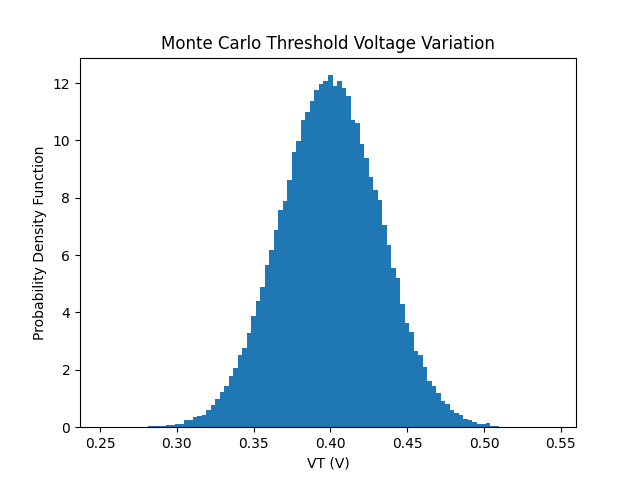

# Monte Carlo Simulation of Threshold Voltage Variation

This project is a Python script for the statistical simulation and analysis of Threshold Voltage ($V_T$) variations in MOSFETs using the Monte Carlo method. The simulation is based on a hypothetical 45 nm technology.

## Project Description
In deep sub-micron technologies, the threshold voltage of a transistor is not constant due to random process variations. This code investigates the impact of three main factors on $V_T$:
1. **Channel Length Variation ($L$):** Accounting for the Drain-Induced Barrier Lowering (DIBL) effect.
2. **Oxide Thickness Variation ($t_{ox}$)**
3. **Random Dopant Fluctuation (RDF)**

The following linearized formula is used to calculate the threshold voltage:
$$V_T = V_{T0} + k_L(L - L_0) + k_{ox}(t_{ox} - t_{ox0}) + RDF$$

## Dependencies
To run this code, you need the following Python libraries:
- `numpy` (for numerical computations and statistical sampling)
- `matplotlib` (for plotting)

You can install them using pip:
```bash
pip install numpy matplotlib
```
## Usage
Simply run the Python script

## Expected Output
Running the script will generate two types of output:
1. **Terminal Output:** The calculated Mean and Standard Deviation of the threshold voltage for 100,000 Monte Carlo samples.
2. **Graphical Output:** A histogram plot showing the Probability Density Function (PDF) of the threshold voltage distribution.

## Nominal Parameters
- Nominal Threshold Voltage ($V_{T0}$): 0.40 V
- Nominal Channel Length ($L_0$): 45 nm
- Nominal Oxide Thickness ($t_{ox0}$): 1.2 nm
